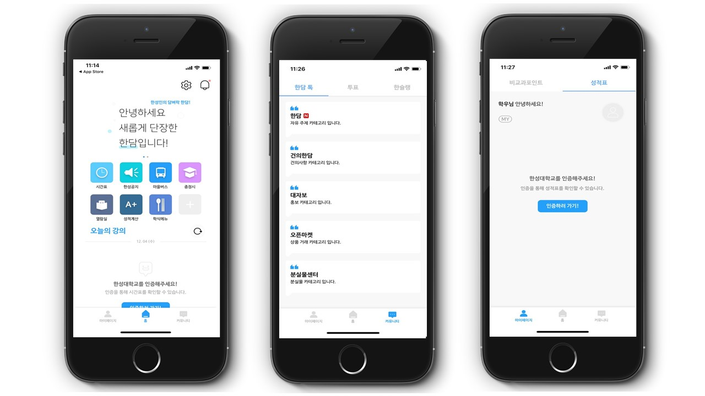

# 한담(HANDAM) 기획/분석 프로젝트

## ○한담(HANDAM) 앱 소개

한성대학교 학생들을 위한 커뮤니티 앱 서비스. 학생들이 자유롭게 의견과 정보를 공유하고 개인학사정보를 열람할 수 있는 서비스 앱입니다. 

 2018년 9월 첫 런칭 이후,  2019 3월에는 대대적인 업데이트를 진행하였고 현재 약 2,900명의 사용자 수를 보유하고 있습니다.  

## ○팀 소개

학생들을 위한 서비스 제공, 개선을 목표로  서비스 팀, 개발 팀,디자인 팀이 협업하여 노력하고 있습니다. 저는 서비스 기획, 분석, 고객관리 등의 역할을 수행했습니다.

## ○현재 서비스

학생들은 개인 학사 정보, 성적,학교 소식 등을 열람할 수 있습니다. 더불어 자유롭게 정보를 공유하기 위해 커뮤니티 서비스를 이용할 수 있습니다.

이는 사용자 경험 분석과 고객과의 소통을 통해 지속적으로 기능을 업데이트하여 이뤄낸 성과입니다.

## ○한담 버전 1 (초기)

한담 서비스의 버전 1 화면 모습입니다. 개선할 점을 찾고 분석하여 기능 추가, 디자인 개편 등 대규모 업데이트를 진행했습니다. 

현재도 팀원들은 '어떻게 하면 사용자, 고객에게 더 좋은 서비스를 제공할 수 있을까?'를 치열하게 고민하며 노력하고있습니다.